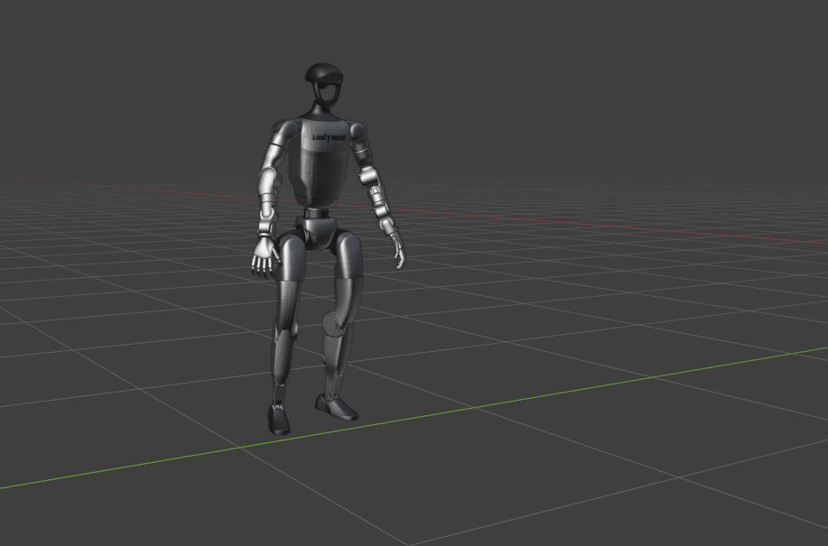
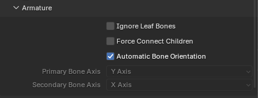

# MotionDecode Dataset — Unitree G1 CSV → FBX/BVH Converter



Converts Unitree G1 humanoid robot motion-capture data (root pose + 29 joint
angles, in CSV) into an animated **FBX** or **BVH** skeleton file, ready to
open in Autodesk MotionBuilder, Blender, Maya, or any other FBX/BVH-compatible
tool. The output format is chosen from the `--output` file extension.

# MotionDecode Homepage

Full information about the dataset can be found at [MotionDecode Dataset](https://chingmudata.github.io/MotionDecode/).

## What it does

- Reads a CSV of per-frame root position/orientation (quaternion) and 29 joint
  angles (radians).
- Builds the Unitree G1 skeleton hierarchy using the exact joint offsets and
  static mounting tilts from the robot's URDF (not an approximation).
- Keyframes root translation/rotation and every joint's rotation across all
  frames.
- **FBX output**: attaches the robot's visual meshes (`.STL`, from the URDF)
  to their corresponding joints, with correct per-link materials, and
  declares an explicit frame rate so every importer (MotionBuilder, Blender,
  etc.) interprets the timing identically.
- **BVH output**: skeleton/animation only (BVH has no mesh support), with
  **no dependency on the Autodesk FBX SDK** — use this if you don't have (or
  don't want to install) the FBX SDK.

## Repository contents

```
csv_to_animation.py                        # the converter (this is the whole tool)
requirements.txt                           # Python dependencies
g1_description/                            # git submodule: github.com/isri-aist/g1_description
  urdf/g1_29dof.urdf                        # Unitree G1 robot description
  meshes/*.STL                              # Unitree G1 visual meshes
```

## Prerequisites

- `numpy` and `scipy` (installed from PyPI, see below) — required for both
  output formats.
- **For FBX output only:**
  - **Python** — only **3.10** has been tested, but other Python versions
    should work as long as you install the matching Autodesk FBX SDK wheel
    for that version (see below). The FBX SDK wheel is tied to a specific
    CPython version (e.g. `cp310`) *and* CPU architecture (e.g.
    `win_amd64`), so the exact wheel filename you need depends on both your
    Python version and your PC's architecture.
  - **Autodesk FBX Python SDK** (tested with 2020.3.7). This is proprietary
    and is **not on PyPI** — you must download it yourself from
    [Autodesk's FBX SDK page](https://aps.autodesk.com/developer/overview/fbx-sdk)
    (free registration required) and install the Python wheel that matches
    your OS, Python version, and architecture.
- **For BVH output:** nothing beyond `numpy`/`scipy` — no FBX SDK, no
  particular Python version required. This is the option to use if you don't
  have (or can't install) the Autodesk SDK.

## Installation

```bash
# 1. Clone the repository, including the g1_description submodule
git clone --recurse-submodules https://github.com/Beyond-Capture/MotionDecode-Viewer.git
cd MotionDecode-Viewer
# If you already cloned without --recurse-submodules:
#   git submodule update --init
# (the submodule provides the URDF + meshes; only needed for FBX export with
#  --mesh enabled — BVH export and FBX with --no-mesh don't need it)

# 2. Create and activate a Python virtual environment
# (3.10 is the only version this has been tested with; other versions should
#  work for FBX export too, as long as you install the matching SDK wheel
#  in step 4 — see Prerequisites above)
python -m venv .venv
# Windows:
.venv\Scripts\activate
# macOS/Linux:
source .venv/bin/activate

# 3. Install numpy/scipy — this alone is enough for BVH export
# (quote each specifier — an unquoted ">=" is parsed as shell output
#  redirection on Windows, e.g. it'll silently dump pip's output into a
#  file named "1.15.0" instead of installing the pinned version)
pip install "numpy>=2.0.0" "scipy>=1.15.0"

# 4. (Only needed for FBX export) Install the Autodesk FBX Python SDK.
# Download the SDK installer from Autodesk, then install the wheel matching
# your Python version and PC architecture, e.g. (cp310 = Python 3.10,
# win_amd64 = 64-bit Windows). Example:
pip install "C:\Program Files\Autodesk\FBX\FBX Python SDK\2020.3.7\fbx-2020.3.7-cp310-none-win_amd64.whl"

# 5. Verify the SDK is importable (skip if you're only exporting BVH)
python -c "import fbx; print('FBX SDK OK')"
```

> **Note:** `requirements.txt` references the FBX SDK wheel via a local
> absolute path (`C:\Program Files\Autodesk\...`) specific to the machine this
> was developed on. `pip install -r requirements.txt` will only work if the
> SDK is installed at that exact path — otherwise, install `numpy`/`scipy`
> from `requirements.txt` and install the FBX SDK wheel separately as shown
> above, pointing at wherever you installed it (or skip it entirely and use
> `--output *.bvh`).

## Usage

The output format is chosen from `--output`'s file extension — `.fbx` or `.bvh`:

```bash
# FBX (skeleton + meshes, requires the Autodesk FBX SDK)
python csv_to_animation.py --input data/CRA_Infant_Crawling_00001.csv --output out.fbx

# BVH (skeleton only, no FBX SDK required)
python csv_to_animation.py --input data/CRA_Infant_Crawling_00001.csv --output out.bvh
```

### Options

| Flag | Default | Description |
|---|---|---|
| `--input` | *(required)* | Input motion CSV path |
| `--output` | *(required)* | Output path; `.fbx` or `.bvh` extension picks the format |
| `--fps` | `30.0` | Frames per second the CSV rows are sampled at |
| `--unwrap` / `--no-unwrap` | unwrap enabled | Continuous-angle unwrapping, avoids ±180° flip artifacts in root/joint rotation curves |
| `--mesh` / `--no-mesh` | mesh enabled | Attach visual meshes — FBX output only, ignored (and unnecessary) for BVH |
| `--urdf` | `g1_description/urdf/g1_29dof.urdf` | URDF used for joint geometry and mesh/material lookup (FBX only) |
| `--mesh-dir` | `g1_description/meshes` | Directory containing the visual mesh `.STL` files (FBX only) |

Examples:

```bash
# Convert the other included example clip to FBX
python csv_to_animation.py --input data/CI_Swing_Punch_00001.csv --output data/CI_Swing_Punch_00001.fbx

# Same clip to BVH instead (no FBX SDK needed)
python csv_to_animation.py --input data/CI_Swing_Punch_00001.csv --output data/CI_Swing_Punch_00001.bvh

# Skeleton only, no meshes (smaller/faster FBX export)
python csv_to_animation.py --input data/CI_Swing_Punch_00001.csv --output out.fbx --no-mesh

# Different frame rate
python csv_to_animation.py --input data/CI_Swing_Punch_00001.csv --output out.fbx --fps 60
```

### CSV format

Each row is one frame: `root_pos_x/y/z(m)`, `root_rot_w/x/y/z` (quaternion),
and 29 columns named `dof_<joint_name>_joint(rad)` matching the joint names
in `g1_29dof.urdf`.

## Output

Both formats share the same joint hierarchy: a `pelvis` root plus 29 joint
nodes (named `dof_<joint_name>_joint`), animated with keyframed rotations.

**FBX** additionally contains:
- One mesh child per joint/link (when `--mesh` is enabled), with materials
  matching the URDF's `dark`/`white` definitions.
- An explicit custom frame rate and animation time span, so the imported
  animation length/speed is consistent across tools.

**BVH** is skeleton/animation only (the format has no mesh support), written
in the conventional Y-up/-Z-forward BVH axis convention (this rig is
authored Z-up internally, matching the FBX export; the conversion is baked
in at export time so a plain default import lands right-side up).

## Compatibility

Verified working in:
- **Autodesk MotionBuilder 2023** — FBX skeleton, meshes, and animation
  import and play correctly out of the box.
- **Blender 5.1** — BVH imports correctly with default import settings. FBX requires the "Legacy" import option with "Automatic Bone Orientation" enabled.



## Data & attribution

- `g1_description/` is included as a git submodule pointing at
  [isri-aist/g1_description](https://github.com/isri-aist/g1_description/tree/main),
  a Unitree G1 robot description package (URDF + MJCF + meshes) maintained by
  [ISRI-AIST](https://github.com/isri-aist). Many thanks to its authors and
  contributors for maintaining and sharing this package — this project's
  skeleton geometry and meshes come directly from their work. See that
  repository (and `g1_description/README.md`) for details, and check its
  license/terms before redistributing those files.

## License

This repository's own code is licensed under
the [MIT License](LICENSE). Note that the `g1_description/` submodule
([isri-aist/g1_description](https://github.com/isri-aist/g1_description/tree/main))
is a separate project with its own license/attribution terms, independent of
this repository's license — check that repository before redistributing its
files.
